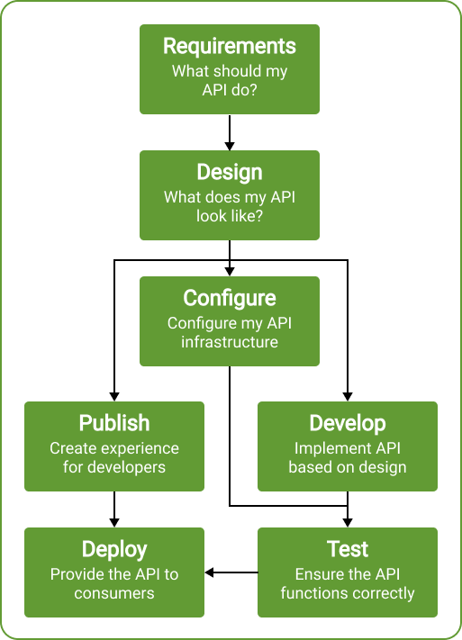
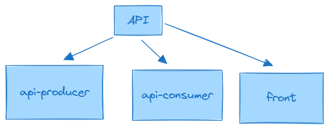

# Open Api Generator DEMO

This is a sample projet to demonstrate the benefits of using OpenApi for defining / designing api
contracts using [OpenApi](https://www.openapis.org/).

## Building/Running this project

### Pre-requisites

- JDK17
- Maven (3.9+)
- Node (latest node v20)

### Building maven project

```bash
mvn clean package
#or 
./mvnw clean package
```

### Launching Angular Application

```bash
# (option ) Generate API dependencies using maven
mvn clean package -pl front -am


#cd  into the front folder
cd front
# Do an NPM install
# (option ) Generate API dependencies using node 
# launch angular application
npm run start
```

## Why using Open API



`OpenAPI`, is a widely used specification for defining APIs. There are several reasons why using OpenAPI for defining
APIs is beneficial:

- **Standardization**: OpenAPI provides a standardized way to describe RESTful APIs. This means that developers,
  regardless of their background or the technologies they are using, can understand the API's structure and
  functionality quickly.
- **Documentation**: With OpenAPI, you can generate interactive documentation for your API automatically. This
  documentation includes details such as endpoints, request parameters, response formats, and authentication
  requirements. This documentation can be invaluable for both internal and external developers who need to understand
  how to use your API.
- **Client Code Generation**: OpenAPI allows for the generation of client code in various programming languages. This
  makes it easier for developers to consume your API, as they can simply generate client code based on the OpenAPI
  specification rather than manually writing HTTP requests.
- **Server Stub Generation**: Similarly, OpenAPI can be used to generate server stubs in different programming
  languages, helping developers quickly set up the server-side infrastructure needed to implement the API.
- **Validation**: OpenAPI specifications can be used to validate API requests and responses, ensuring that they conform
  to the expected format and structure. This helps catch errors early in the development process and improves the
  overall quality and reliability of the API.
- **Tooling Ecosystem**: There is a rich ecosystem of tools built around OpenAPI, including editors, validators, code
  generators, and documentation generators. This ecosystem makes it easier to work with OpenAPI and integrate it into
  your development workflow.

Overall, using OpenAPI for defining APIs can streamline the development process, improve documentation and
communication, and enhance the overall quality and usability of your APIs.

## Project presentation

The project is for the most part maven multi-module projet.



- `api`: core module containing our API
- `api-producer`: spring application implementing our API
- `api-consumer`: spring application command line application consuming our API
- `front`: angular application consuming our API

### Exercice 1

In the `api` modules, open the `src/main/resources/openapi.yml` spec file

Let's create a quick specification if the following endpoints:

```
# CREATE A BOOK
POST localhost:8080/book
Content-Type: application/json

{
  "title": "Coucou",
  "nbOfPages": 2
}


# Get all Books
GET localhost:8080/book
Content-Type: application/json

```

- Once the spec is defined, you can build it with maven `mvn clean package`.
    - Check that, in the `api-producer` module a
      class `api-producer/target/generated-sources/openapi/src/main/java/com/example/api/producer/BookApi.java` has been
      generated

Apply the first implementation by extending the modifying the `DemoController` as:

```java
@RestController
@CrossOrigin
public class DemoController implements BookApi {

}
```
